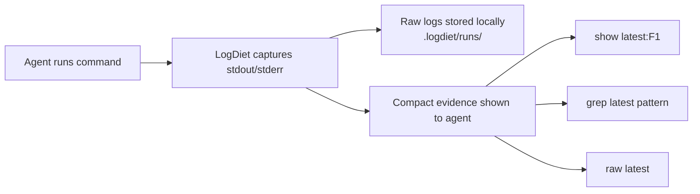

# LogDiet

<p align="center">
  <a href="./README.md">English</a> ·
  <a href="./README.ko.md">한국어</a>
</p>

<p align="center">
  <strong>코딩 에이전트에게 토큰 다이어트를 시키세요.</strong>
</p>

<p align="center">
  전체 로그는 보관하고, 노이즈는 줄입니다.
</p>

<p align="center">
  LogDiet은 전체 명령어 로그를 로컬에 저장하고, AI 코딩 에이전트에게는 작고 펼쳐볼 수 있는 증거만 보여주는 로컬 CLI 도구입니다.
</p>

<p align="center">
  <a href="https://github.com/yoon-sang-won/LogDiet/actions/workflows/test.yml"></a>
  <a href="./LICENSE"></a>
  
  
  
</p>

No network. No telemetry. No model/API calls.

## AI 에이전트에게 로그 벽을 먹이지 마세요

AI 코딩 에이전트는 코드를 고치는 데 능숙하지만, 터미널 출력 때문에 컨텍스트를 쉽게 낭비합니다.

- 긴 테스트 로그
- 반복되는 stack trace
- 시끄러운 build output
- 큰 diff
- grep 결과
- 실제 실패를 가리는 warning

이 출력은 여전히 중요합니다. 다만 에이전트가 한 번에 전부 볼 필요는 없습니다.

LogDiet은 전체 출력은 로컬에 보관하고, 에이전트에게는 더 작고 구조화된 화면을 제공합니다.

- 어떤 명령이 실행됐는지
- 통과했는지 실패했는지
- 가장 관련 있는 실패 증거
- 필요할 때 정확한 원문 줄을 펼쳐볼 수 있는 핸들

## Before / After

### Before: 에이전트가 로그 벽 전체를 봅니다

```text
pytest -q
... 수천 줄의 traceback, warning, retry, progress output ...
... 반복되는 stack frame ...
... 관련 없는 warning ...
... 실제 실패 원인은 어딘가에 묻혀 있음 ...
```

### After: 에이전트가 짧은 증거만 봅니다

```text
logdiet run 20260627T120000Z-12345-a1b2 exit=1 raw=.logdiet/runs/20260627T120000Z-12345-a1b2
cmd: pytest -q
summary: 2 failed, 31 passed
F1 tests/test_api.py:42 AssertionError: expected 200, got 500
F2 tests/test_auth.py:17 ValueError: missing token
show: logdiet show latest:F1 --around 40
raw:  logdiet raw latest
grep: logdiet grep latest "pattern"
stats: raw=18420B compact=610B approx_saved=96.7%
```

전체 원문 로그는 `.logdiet/runs/` 아래 로컬에 남아 있습니다.

이 예시는 합성 예시입니다. `approx_saved`는 바이트 기준 감소 추정치이며 실제 provider billing 측정값이 아닙니다.

## LogDiet의 동작 방식



핵심은 단순합니다. 원문 로그는 디스크에 보관하고, 터미널에는 짧은 증거를 보여주며, 필요할 때만 정확한 원문을 펼쳐봅니다.

## 60초 안에 써보기

### macOS / Linux

```sh
go install github.com/yoon-sang-won/LogDiet/cmd/logdiet@latest
logdiet install
eval "$(logdiet env)"
logdiet doctor
logdiet wrap -- go test ./...
```

### PowerShell

```powershell
go install github.com/yoon-sang-won/LogDiet/cmd/logdiet@latest
logdiet install
Invoke-Expression (logdiet env --shell powershell)
logdiet doctor
logdiet wrap -- go test ./...
```

`@latest`는 release tag가 만들어진 뒤 가장 안정적으로 동작합니다.

## AI 에이전트를 위한 사용법

LogDiet이 설치되어 있고 `.logdiet/bin`이 `PATH`의 앞에 있을 때:

- `go test ./...`, `pytest`, `npm test`, `git diff`, `rg` 같은 명령을 평소처럼 실행하세요.
- LogDiet이 출력한 짧은 증거를 먼저 읽으세요.
- 특정 핸들이 필요하면 `logdiet show latest:F1 --around 40`을 사용하세요.
- 원문 로그를 검색하려면 `logdiet grep latest "pattern"`을 사용하세요.
- 짧은 증거가 부족할 때만 `logdiet raw latest`를 사용하세요.
- `show`, `grep`, `raw`로도 부족할 때만 사용자에게 전체 로그를 요청하세요.

좋은 에이전트 응답은 짧은 증거를 먼저 인용하고, 필요한 경우에만 원문을 펼쳐봅니다.

## 함께 쓰기 좋은 환경

| 에이전트 / 워크플로 | 설정 |
|---|---|
| Codex | `logdiet setup codex` |
| Claude Code | `logdiet setup claude` |
| Cursor | `logdiet setup cursor` |
| Antigravity | `logdiet setup antigravity` |
| Gemini | `logdiet setup gemini` |
| 일반 터미널 에이전트 | `logdiet install` |

## 주요 명령어

| 명령어 | 언제 쓰나요 |
|---|---|
| `logdiet install` | 로컬 상태와 PATH shim을 설정할 때 |
| `logdiet env` | shell 활성화 명령을 출력할 때 |
| `logdiet doctor` | 현재 세션이 LogDiet을 쓰는지 확인할 때 |
| `logdiet wrap -- <cmd>` | 명령 하나를 수동으로 캡처할 때 |
| `logdiet show latest:F1 --around 40` | 증거 핸들 하나를 펼쳐볼 때 |
| `logdiet grep latest "pattern"` | 원문 로그에서 패턴을 검색할 때 |
| `logdiet raw latest` | 전체 raw output을 출력할 때 |
| `logdiet setup codex` | Codex용 규칙 파일을 설치할 때 |

## 에이전트별 빠른 시작

### Codex

```sh
go install github.com/yoon-sang-won/LogDiet/cmd/logdiet@latest
logdiet setup codex
eval "$(logdiet env)"
logdiet doctor
codex
```

`AGENTS.md`를 만들거나 업데이트합니다.

### Claude Code

```sh
go install github.com/yoon-sang-won/LogDiet/cmd/logdiet@latest
logdiet setup claude
eval "$(logdiet env)"
logdiet doctor
claude
```

`CLAUDE.md`를 만들거나 업데이트합니다.

### Cursor

```sh
go install github.com/yoon-sang-won/LogDiet/cmd/logdiet@latest
logdiet setup cursor
eval "$(logdiet env)"
logdiet doctor
```

`.cursor/rules/logdiet.mdc`를 만들거나 업데이트합니다.

### Antigravity

```sh
go install github.com/yoon-sang-won/LogDiet/cmd/logdiet@latest
logdiet setup antigravity
eval "$(logdiet env)"
logdiet doctor
```

`.agents/rules/logdiet.md`를 만들거나 업데이트합니다.

### Gemini

```sh
go install github.com/yoon-sang-won/LogDiet/cmd/logdiet@latest
logdiet setup gemini
eval "$(logdiet env)"
logdiet doctor
```

`GEMINI.md`를 만들거나 업데이트합니다.

### 일반 터미널 에이전트

```sh
go install github.com/yoon-sang-won/LogDiet/cmd/logdiet@latest
logdiet install
eval "$(logdiet env)"
logdiet doctor
```

전용 규칙 파일이 없는 터미널 기반 에이전트에 사용하세요.

## 원문 로그 펼쳐보기

```sh
logdiet show latest:F1 --around 40
logdiet raw latest --combined --tail 80
logdiet grep latest "AssertionError" --around 3
```

원문 확장은 정확합니다. 짧은 증거만으로 부족할 때 사용하세요.

## PATH Shim

`logdiet install`은 `.logdiet/bin`에 로컬 command shim을 만듭니다. 에이전트 세션에서 이 디렉터리가 `PATH`의 앞에 오도록 설정하면 일반 명령도 자동으로 캡처됩니다.

- `LOGDIET_BYPASS=1`: 실제 명령을 직접 실행합니다.
- `LOGDIET_MODE=auto`: 유용한 명령만 짧은 증거로 바꿉니다.
- `LOGDIET_MODE=force`: shimmed command 전체를 짧은 증거로 바꿉니다.
- `LOGDIET_MODE=off`: compaction을 끕니다.

v0.1에서는 shell profile을 자동으로 수정하지 않습니다.

## 벤치마크 예시

```sh
logdiet bench-fixtures
```

```text
fixture                  raw_bytes compact_bytes  approx_raw_tokens approx_compact_tokens  reduction handles
go_test_failure.txt            670           314                168                    79      53.1%       1
pytest_failure.txt             934           532                234                   133      43.0%       3
git_diff.txt                   924           630                231                   158      31.8%       2
```

토큰 추정치는 `ceil(bytes / 4)` 기반 근사값이며 provider billing 측정값이 아닙니다.

## 개인정보와 로컬 우선 설계

LogDiet은 local-first로 동작합니다.

- network call 없음
- telemetry 없음
- model/API call 없음
- 전체 raw log는 내 컴퓨터에 남음
- 생성된 실행 로그는 `.logdiet/runs/` 아래에 저장됨

raw log에는 secret, token, private path, proprietary output이 들어갈 수 있습니다. `.logdiet/runs/`를 커밋하지 말고 공유 전 로그를 확인하세요.

## LogDiet이 아닌 것

LogDiet은 다음이 아닙니다.

- model proxy
- prompt compressor
- cloud service
- telemetry collector
- provider prompt caching 대체품
- 로그를 버리는 도구
- 정확한 provider-token savings를 주장하는 benchmark

LogDiet은 로컬 command-output capture와 evidence layer입니다.

## FAQ

### LogDiet이 로그를 외부로 보내나요?

아니요. LogDiet은 network call을 하지 않고, telemetry를 보내지 않으며, model/API를 호출하지 않습니다.

### raw log는 삭제되나요?

아니요. 전체 raw command output은 로컬 `.logdiet/runs/` 아래에 저장됩니다.

### raw log에 비밀값이 들어갈 수 있나요?

네. secret, token, path, private data가 들어갈 수 있습니다. `.logdiet/runs/`를 커밋하지 말고 공유 전 로그를 확인하세요.

### provider 비용을 줄여주나요?

LogDiet은 AI 코딩 에이전트 대화에 넣는 명령어 출력량을 줄이는 데 도움을 줍니다. provider billing savings를 측정하거나 보장하지 않습니다.

### PATH shim이 꼭 필요한가요?

아니요. `logdiet wrap -- <command>`로 수동 캡처할 수 있습니다. PATH shim은 에이전트 세션에서 명령을 자동으로 캡처하고 싶을 때 사용합니다.

## 검증하기

릴리스나 로컬 상태를 확인하려면:

```sh
git clone https://github.com/yoon-sang-won/LogDiet
cd LogDiet
./scripts/verify-release.sh
```

자세한 수동 검증 절차는 [docs/verification.md](docs/verification.md)를 보세요.

## 제한 사항

- v0.1의 `combined.txt`는 stdout 뒤에 stderr를 붙이므로 stream 간 순서는 best-effort입니다.
- compaction은 deterministic pattern extraction이며 semantic understanding이 아닙니다.
- parser는 흔한 실패 형태를 중심으로 처리하므로 특이한 출력은 놓칠 수 있습니다.
- Windows command lookup은 `.exe`, `.cmd`, `.bat`, `.com`을 지원합니다.
- daemon, TUI, editor extension, MCP server, model proxy, cloud dashboard가 아닙니다.

## 개발과 릴리스

```sh
go install ./cmd/logdiet
gofmt -w .
go test ./...
```

릴리스 전에는 [docs/release-checklist.md](docs/release-checklist.md)를 확인하세요.

관련 문서:

- [README.md](README.md)
- [CHANGELOG.md](CHANGELOG.md)
- [docs/demo.md](docs/demo.md)
- [docs/verification.md](docs/verification.md)
- [docs/release-checklist.md](docs/release-checklist.md)

## 라이선스

LogDiet은 Apache-2.0 라이선스로 배포됩니다.
