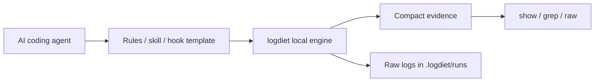

# LogDiet

<p align="center">
  <a href="./README.md">English</a> |
  <a href="./README.ko.md">한국어</a>
</p>

<p align="center">
  <strong>AI 코딩 에이전트를 위한 agent-native 토큰 다이어트 레이어.</strong>
</p>

<p align="center">
  LogDiet은 시끄러운 터미널 명령 출력을 compact evidence로 바꾸고 전체 원문 로그는 로컬에 보관합니다.
</p>

<p align="center">
  Agent-first. CLI-powered. No network. No telemetry.
</p>

<p align="center">
  <a href="https://github.com/yoon-sang-won/LogDiet/actions/workflows/test.yml"></a>
  <a href="./LICENSE"></a>
  
  
  
</p>

No network. No telemetry. No model/API calls.

A token diet kit your coding agent can install and use by itself.

LogDiet 링크를 한 번 넘겨주면, 에이전트가 긴 테스트/빌드/git/검색 로그를 compact evidence로 줄여서 사용하게 됩니다.

## 가장 쉬운 사용법: 에이전트에게 맡기기

AI 코딩 에이전트에게 이렇게 말하세요.

```text
Install https://github.com/yoon-sang-won/LogDiet and use it for noisy test/build/git/search output.
```

에이전트는 다음 흐름을 실행하면 됩니다.

```sh
go install github.com/yoon-sang-won/LogDiet/cmd/logdiet@latest
logdiet bootstrap --agent auto
logdiet doctor
logdiet agent-instructions --agent auto
```

그 뒤 에이전트는 긴 출력이 나올 수 있는 명령을 이렇게 실행해야 합니다.

```sh
logdiet wrap -- go test ./...
logdiet wrap -- pytest -q
logdiet wrap -- npm test
logdiet wrap -- git diff
logdiet wrap -- rg "pattern"
```

필요할 때만 evidence를 펼칩니다.

```sh
logdiet show latest:F1 --around 40
logdiet grep latest "panic"
logdiet raw latest
```

hook은 고급 옵션입니다. 기본 흐름은 agent rules와 명시적인 `logdiet wrap`만으로 동작합니다.

## bootstrap 이후에는 무엇이 달라지나요?

LogDiet은 현재 프로젝트에 에이전트용 rules를 설치합니다.

그 뒤 에이전트는:

1. 긴 출력이 나올 수 있는 명령을 `logdiet wrap -- <command>`로 실행하고;
2. compact evidence를 먼저 읽고;
3. 필요할 때만 정확한 원문 로그를 펼쳐 보고;
4. 사용자에게 전체 로그를 붙여 넣어 달라고 요청하지 않아야 합니다.

command hook을 지원하는 환경에서는 더 자동화할 수 있지만, 기본 사용에는 hook이 필요하지 않습니다.

## 왜 필요한가

코딩 에이전트에는 터미널 벽 전체가 아니라 정확한 증거가 필요합니다. 긴 테스트 로그, diff, 검색 결과, stack trace는 컨텍스트를 많이 쓰면서 중요한 줄을 숨깁니다.

LogDiet은 전체 출력을 로컬 디스크에 저장하고, 에이전트에는 확장 가능한 compact evidence만 보여줍니다.

## Before / After

### Before

```text
pytest -q
... 수천 줄의 traceback, warning, retry, progress output ...
... 반복되는 stack frame ...
... 관련 없는 warning ...
... 실제 실패 원인이 위쪽에 묻혀 있음 ...
```

### After

```text
logdiet run 20260627T120000Z-12345-a1b2 exit=1 raw=.logdiet/runs/20260627T120000Z-12345-a1b2
cmd: pytest -q
summary: 2 failed, 31 passed
F1 tests/test_api.py:42 AssertionError: expected 200, got 500
F2 tests/test_auth.py:17 ValueError: missing token
show: logdiet show latest:F1 --around 40
raw:  logdiet raw latest
grep: logdiet grep latest "pattern"
stats: raw=18420B compact=610B approx_saved=96.7%
```

이 예시는 합성 예시입니다. `approx_saved`는 바이트 기준 감소 추정치이며 provider billing 측정값이 아닙니다.

## LogDiet의 레이어

LogDiet v0.2는 두 레이어로 동작합니다.

1. 에이전트 통합 레이어
   - plugin / skill / rules / hook 형태로 에이전트에 설치합니다.
   - 에이전트가 로그 벽을 그대로 붙여 넣지 않도록 지시합니다.
   - hook을 지원하는 환경에서는 noisy command를 `logdiet wrap -- <cmd>`로 rewrite합니다.

2. 로컬 CLI 엔진
   - 실제 명령을 실행하고 stdout/stderr를 캡처합니다.
   - 전체 원문 로그를 `.logdiet/runs/`에 저장합니다.
   - 에이전트에게 compact evidence를 보여줍니다.
   - 필요하면 `show`, `grep`, `raw`로 원문을 펼쳐봅니다.



자동 명령 rewrite는 에이전트가 command hook을 지원하는 경우에만 동작합니다. 그 외 환경에서는 rules/instructions 또는 `logdiet wrap` 수동 모드를 사용합니다.

## Quickstart: 에이전트에 설치

### Codex

```sh
go install github.com/yoon-sang-won/LogDiet/cmd/logdiet@latest
logdiet setup codex --mode all
logdiet doctor
codex
```

### Codex 검증

LogDiet은 Codex용 rules와 hook template을 생성할 수 있습니다.

```sh
logdiet setup codex --mode all
logdiet doctor
./scripts/verify-codex-integration.sh
```

Codex가 hook 검토를 요구하면 Codex 안에서 `/hooks`를 열고, 생성된 LogDiet hook을 직접 확인한 뒤 trust하세요.

자동 command rewrite는 Codex hook이 지원되고 trust된 경우에만 동작합니다. hook을 사용할 수 없는 환경에서는 `AGENTS.md` rules fallback을 통해 `logdiet wrap -- <command>`를 사용합니다.

### Claude Code

```sh
go install github.com/yoon-sang-won/LogDiet/cmd/logdiet@latest
logdiet setup claude --mode all
logdiet doctor
claude
```

### 기타 에이전트

```sh
go install github.com/yoon-sang-won/LogDiet/cmd/logdiet@latest
logdiet setup cursor --mode rules
logdiet setup gemini --mode rules
logdiet setup antigravity --mode rules
logdiet doctor
```

### 수동 엔진 모드

```sh
logdiet wrap -- go test ./...
logdiet show latest:F1 --around 40
logdiet grep latest "panic"
logdiet raw latest
```

## Hook rewrite bridge

trusted command hook을 지원하는 에이전트는 다음 명령으로 rewrite 결정을 받을 수 있습니다.

```sh
logdiet hook rewrite --command "go test ./..."
```

예시:

```json
{"wrap":true,"command":"logdiet wrap -- go test ./...","reason":"known noisy developer command"}
```

이 bridge는 결정을 JSON으로 반환할 뿐 명령을 실행하지 않습니다.

## 지원 패키지

통합 패키지는 `integrations/` 아래에 있습니다.

- Codex: `integrations/codex/`
- Claude Code: `integrations/claude-code/`
- Cursor: `integrations/cursor/`
- Gemini: `integrations/gemini/`
- Antigravity: `integrations/antigravity/`
- Generic terminal agents: `integrations/generic/`

v0.2 구조는 [docs/agent-native.md](docs/agent-native.md)를 참고하세요.
self-install 흐름은 [docs/agent-self-install.md](docs/agent-self-install.md)를 참고하세요.
에이전트에게 줄 복사/붙여넣기 프롬프트는 [docs/first-agent-prompt.md](docs/first-agent-prompt.md)를 참고하세요.

## 주요 명령

```sh
logdiet install
logdiet setup codex --mode rules
logdiet setup codex --mode shim
logdiet setup codex --mode native
logdiet setup codex --mode all
logdiet doctor
logdiet wrap -- pytest -q
logdiet show latest:F1 --around 40
logdiet raw latest
logdiet grep latest "pattern"
logdiet hook rewrite --command "go test ./..."
logdiet bench-fixtures
```

## setup mode

| Mode | 동작 |
| ---- | ---- |
| `rules` | 에이전트 rules/instructions만 설치 |
| `shim` | rules와 `.logdiet/bin` PATH shim 설치 |
| `native` | rules와 로컬 native hook/plugin template 설치 |
| `all` | rules, shim, native template 모두 설치 |

native template은 검토용 파일입니다. LogDiet은 위험할 수 있는 hook을 조용히 활성화하지 않습니다.

## 프라이버시와 보안

- 원문 로그는 `.logdiet/runs/` 아래 로컬에 남습니다.
- hook은 명령 실행을 바꿀 수 있으므로 활성화 전에 template을 검토해야 합니다.
- 원문 로그에는 secret, token, private path, proprietary output이 포함될 수 있습니다.
- `.logdiet/runs/`와 `.logdiet/backup/`을 커밋하지 마세요.

## LogDiet이 아닌 것

LogDiet은 다음이 아닙니다.

- model proxy
- prompt compressor
- cloud service
- telemetry collector
- daemon
- web UI
- provider-token 절감량을 정확히 측정한다고 주장하는 benchmark

## 검증

```sh
gofmt -w .
go test ./...
go install ./cmd/logdiet
./scripts/verify-release.sh
./scripts/verify-agent-self-install.sh
```

v0.2 검증은 [docs/v0.2-verification.md](docs/v0.2-verification.md)를 참고하세요.

## 라이선스

LogDiet은 Apache-2.0 라이선스를 사용합니다.
