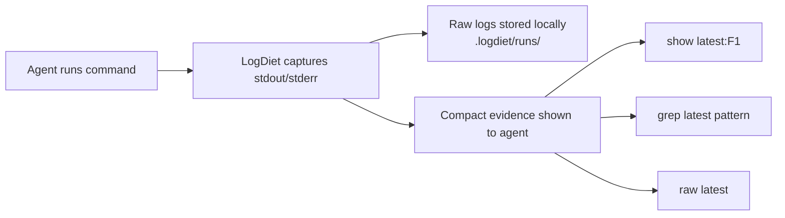

# LogDiet

<p align="center">
  <a href="./README.md">English</a> ·
  <a href="./README.ko.md">한국어</a>
</p>

<p align="center">
  <strong>Put your coding agent on a token diet.</strong>
</p>

<p align="center">
  Keep full logs locally. Feed agents compact evidence.
</p>

<p align="center">
  <a href="https://github.com/yoon-sang-won/LogDiet/actions/workflows/test.yml"></a>
  <a href="./LICENSE"></a>
  
  
  
  
</p>

LogDiet keeps full command logs locally and feeds AI coding agents compact, expandable evidence instead of noisy terminal walls.

No network. No telemetry. No model/API calls.

## The problem

AI coding agents are good at fixing code, but they often waste context on terminal output:

- long test logs;
- repeated stack traces;
- noisy build output;
- huge diffs;
- grep results;
- warnings that hide the actual failure.

Most of that output still matters, but the agent does not need all of it at once.

## The LogDiet loop

1. Run commands normally or through `logdiet wrap`.
2. LogDiet stores the full raw output under `.logdiet/runs/`.
3. The agent sees compact evidence with handles like `latest:F1`.
4. The agent expands only what it needs with `show`, `raw`, or `grep`.



```sh
logdiet show latest:F1 --around 40
logdiet raw latest
logdiet grep latest "panic"
```

## Before and after

### Before: agent sees the whole wall

```text
pytest -q
... thousands of lines of traceback, warnings, retries, and progress output ...
```

### After: agent sees compact evidence

```text
logdiet run 20260627T120000Z-12345-a1b2 exit=1 raw=.logdiet/runs/20260627T120000Z-12345-a1b2
cmd: pytest -q
summary: 2 failed, 31 passed
F1 tests/test_api.py:42 AssertionError: expected 200, got 500
F2 tests/test_auth.py:17 ValueError: missing token
show: logdiet show latest:F1 --around 40
raw:  logdiet raw latest
grep: logdiet grep latest "pattern"
stats: raw=18420B compact=610B approx_saved=96.7%
```

This example is synthetic. `approx_saved` is a byte-based reduction estimate, not a provider billing measurement.

## Try It In 60 Seconds

### macOS / Linux

```sh
go install github.com/yoon-sang-won/LogDiet/cmd/logdiet@latest
logdiet install
eval "$(logdiet env)"
logdiet doctor
logdiet wrap -- go test ./...
```

### PowerShell

```powershell
go install github.com/yoon-sang-won/LogDiet/cmd/logdiet@latest
logdiet install
Invoke-Expression (logdiet env --shell powershell)
logdiet doctor
logdiet wrap -- go test ./...
```

`@latest` works best after a release tag exists. Before a release tag, use the current branch or a commit version if needed.

## TL;DR

LogDiet is local command I/O portion control for AI coding agents.

It:

- captures full command output locally;
- shows the agent compact evidence;
- lets the agent expand exact raw lines with `show`, `raw`, and `grep`;
- works with project-local PATH shims;
- supports Codex, Claude Code, Cursor, Antigravity, Gemini, and generic terminal agents.

## Works with

| Agent / workflow | Setup |
|---|---|
| Codex | `logdiet setup codex` |
| Claude Code | `logdiet setup claude` |
| Cursor | `logdiet setup cursor` |
| Antigravity | `logdiet setup antigravity` |
| Gemini | `logdiet setup gemini` |
| Generic terminal agents | `logdiet install` |

## Core commands

| Command | Use it when |
|---|---|
| `logdiet install` | Set up local state and PATH shims |
| `logdiet env` | Print shell activation commands |
| `logdiet doctor` | Check whether the current session uses LogDiet |
| `logdiet wrap -- <cmd>` | Capture one command manually |
| `logdiet show latest:F1 --around 40` | Expand one evidence handle |
| `logdiet grep latest "pattern"` | Search exact raw output |
| `logdiet raw latest` | Print full raw output |
| `logdiet setup codex` | Install Codex-facing rules |

## For AI agents

When LogDiet is installed and `.logdiet/bin` is first in `PATH`:

- run normal commands such as `go test ./...`, `pytest`, `npm test`, `git diff`, or `rg`;
- read the compact evidence LogDiet prints;
- use `logdiet show latest:F1 --around 40` when a handle needs expansion;
- use `logdiet grep latest "pattern"` to search exact raw output;
- use `logdiet raw latest` only when compact evidence is insufficient;
- do not ask the user to paste full logs unless `show`, `grep`, and `raw` are insufficient.

A good agent response should cite the compact evidence first, then ask for raw expansion only when needed.

## Who this is for

LogDiet is useful if you use:

- Codex;
- Claude Code;
- Cursor;
- Antigravity;
- Gemini CLI;
- Aider, opencode, or other terminal-based coding agents;
- any workflow where test, build, search, or diff output gets pasted into an AI context window.

It is especially useful when commands produce long output but only a few lines explain the failure.

## Agent Quickstarts

### Codex

```sh
go install github.com/yoon-sang-won/LogDiet/cmd/logdiet@latest
logdiet setup codex
eval "$(logdiet env)"
logdiet doctor
codex
```

Creates or updates `AGENTS.md`.

### Claude Code

```sh
go install github.com/yoon-sang-won/LogDiet/cmd/logdiet@latest
logdiet setup claude
eval "$(logdiet env)"
logdiet doctor
claude
```

Creates or updates `CLAUDE.md`.

### Cursor

```sh
go install github.com/yoon-sang-won/LogDiet/cmd/logdiet@latest
logdiet setup cursor
eval "$(logdiet env)"
logdiet doctor
```

Creates or updates `.cursor/rules/logdiet.mdc`.

### Antigravity

```sh
go install github.com/yoon-sang-won/LogDiet/cmd/logdiet@latest
logdiet setup antigravity
eval "$(logdiet env)"
logdiet doctor
```

Creates or updates `.agents/rules/logdiet.md`.

### Gemini

```sh
go install github.com/yoon-sang-won/LogDiet/cmd/logdiet@latest
logdiet setup gemini
eval "$(logdiet env)"
logdiet doctor
gemini
```

Creates or updates `GEMINI.md`.

### Generic terminal agents

```sh
go install github.com/yoon-sang-won/LogDiet/cmd/logdiet@latest
logdiet install
eval "$(logdiet env)"
logdiet rules --print
logdiet doctor
```

Use this when your agent reads terminal output but does not have a dedicated rules file.

## Manual Wrapper

```sh
logdiet wrap -- go test ./...
logdiet raw latest
logdiet grep latest "panic"
logdiet show latest:F1 --around 40
```

Use the manual wrapper when you do not want PATH shims or when you only need to capture one command.

## Raw Expansion

```sh
logdiet show latest:F1 --around 40
logdiet raw latest --combined --tail 80
logdiet grep latest "AssertionError" --around 3
```

Compact output may shorten noise, but LogDiet does not discard raw logs. Raw files can contain secrets, tokens, private paths, proprietary code, or other sensitive data. Do not commit `.logdiet/runs`.

## PATH Shims

`logdiet install` creates local command shims in `.logdiet/bin`. Prepend that directory to `PATH` inside the terminal or agent session.

Controls:

- `LOGDIET_BYPASS=1` runs the real command directly.
- `LOGDIET_MODE=auto` compacts known useful commands.
- `LOGDIET_MODE=force` compacts every shimmed command.
- `LOGDIET_MODE=off` bypasses compaction.

No shell profiles are modified in v0.1.

## Instruction Lint

```sh
logdiet lint-instructions
logdiet lint-instructions --json
logdiet lint-instructions --fix
```

The linter scans common agent instruction files for cache-breaking noise: generated timestamps, absolute local paths, duplicate lines, duplicate managed sections, large code fences, long examples, volatile command output, and rules that require step-by-step narration.

## Optional Response Contract

```sh
logdiet rules --print
logdiet rules --install codex
logdiet rules --install claude
logdiet rules --install cursor
logdiet rules --install antigravity
logdiet rules --install gemini
```

Installed rules are wrapped in managed markers and are safe to re-run. Existing files are backed up under `.logdiet/backup/` before mutation.

## Doctor

```sh
logdiet doctor
```

`doctor` checks the current session: binary path, current directory, `.logdiet` state, shim directory, `PATH`, installed shims, real command resolution, LogDiet environment variables, latest run, and agent rule files.

Run it in the same terminal or agent session where commands will execute.

## Fixture Benchmarks

```sh
logdiet bench-fixtures
```

Sample output from synthetic local fixtures:

```text
fixture                  raw_bytes compact_bytes  approx_raw_tokens approx_compact_tokens  reduction handles
go_test_failure.txt            670           314                168                    79      53.1%       1
pytest_failure.txt             934           532                234                   133      43.0%       3
git_diff.txt                   924           630                231                   158      31.8%       2
```

Approximate token estimates use `ceil(bytes / 4)` and are not provider billing measurements.

## Trust but verify

To verify a release from a fresh clone:

```sh
git clone https://github.com/yoon-sang-won/LogDiet
cd LogDiet
./scripts/verify-release.sh
```

For manual verification, see [docs/verification.md](docs/verification.md).

More release resources:

- [README.ko.md](README.ko.md)
- [CHANGELOG.md](CHANGELOG.md)
- [docs/demo.md](docs/demo.md)
- [docs/verification.md](docs/verification.md)
- [docs/release-checklist.md](docs/release-checklist.md)

## Privacy

No network. No telemetry. No model/API calls.

LogDiet stores raw logs locally under `.logdiet/runs/`. Compact output may still include snippets from raw logs, so treat terminal output as potentially sensitive.

## What LogDiet is

LogDiet is a local command-output capture and evidence layer for AI coding-agent sessions. The core primitive is lossless local command-output capture with compact expandable evidence handles.

Every wrapped command stores `stdout.txt`, `stderr.txt`, `combined.txt`, `meta.json`, and `index.json`. The terminal receives a short summary with evidence handles such as `F1`, `E1`, `D1`, or `G1`.

## What LogDiet is not

LogDiet is not:

- a model proxy;
- a prompt compressor;
- a cloud service;
- a telemetry collector;
- a replacement for provider prompt caching;
- a tool that discards logs;
- a benchmark claiming exact provider-token savings.

It is a local command-output capture and evidence layer.

## FAQ

### Does LogDiet send my logs anywhere?

No. LogDiet does not make network calls, does not send telemetry, and does not call models or APIs.

### Are raw logs deleted?

No. Full raw command output is stored locally under `.logdiet/runs/`.

### Can raw logs contain secrets?

Yes. Raw logs can contain secrets, tokens, paths, and private data. Do not commit `.logdiet/runs/` and review logs before sharing them.

### Does LogDiet reduce my provider bill?

LogDiet reduces the amount of command output you feed into an AI coding-agent conversation. It does not measure or guarantee provider billing savings.

### Do I need PATH shims?

No. You can use `logdiet wrap -- <command>` manually. PATH shims are for agent sessions where commands should be captured automatically.

## Design Boundaries

See [docs/design-boundaries.md](docs/design-boundaries.md). LogDiet is independently implemented Apache-2.0 code and uses synthetic fixtures.

## Limitations

- `combined.txt` appends stdout then stderr in v0.1, so cross-stream ordering is best-effort.
- Compaction is deterministic pattern extraction, not semantic understanding.
- Parsers focus on common failure shapes and may miss unusual tool output.
- Windows command lookup supports `.exe`, `.cmd`, `.bat`, and `.com`.
- No daemon, TUI, editor extension, MCP server, model proxy, or cloud dashboard is included.

## Uninstall

```sh
logdiet uninstall
logdiet uninstall --rules
```

Uninstall removes managed shims and optionally managed response-rule sections. It does not delete `.logdiet/runs` by default.

## Development

```sh
go install ./cmd/logdiet
gofmt -w .
go test ./...
```

LogDiet is standard-library-only Go. Do not add network calls, telemetry, or third-party dependencies for v0.1.

## Release

Run the release checklist in [docs/release-checklist.md](docs/release-checklist.md).

```sh
./scripts/verify-release.sh
git tag v0.1.0
git push origin v0.1.0
```

`go install github.com/yoon-sang-won/LogDiet/cmd/logdiet@latest` works best after a release tag exists.

## License

LogDiet is licensed under Apache-2.0.
