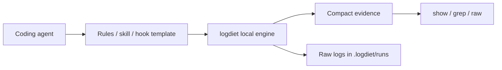

# LogDiet

<p align="center">
  <a href="./README.md">English</a> |
  <a href="./README.ko.md">한국어</a>
</p>

<p align="center">
  <strong>Agent-native token diet for coding agents.</strong>
</p>

<p align="center">
  LogDiet rewrites noisy terminal commands into compact, expandable evidence while keeping full raw logs local.
</p>

<p align="center">
  Agent-first. CLI-powered. No network. No telemetry.
</p>

<p align="center">
  <a href="https://github.com/yoon-sang-won/LogDiet/actions/workflows/test.yml"></a>
  <a href="./LICENSE"></a>
  
  
  
</p>

No network. No telemetry. No model/API calls.

A token diet kit your coding agent can install and use by itself.

Give LogDiet to your coding agent once; it learns to run noisy commands through compact, expandable evidence.

## Easiest path: tell your agent

Give your coding agent this instruction:

```text
Install https://github.com/yoon-sang-won/LogDiet and use it for noisy test/build/git/search output.
```

The agent should run:

```sh
go install github.com/yoon-sang-won/LogDiet/cmd/logdiet@latest
logdiet bootstrap --agent auto
logdiet doctor
logdiet agent-instructions --agent auto
```

Then it should use LogDiet for noisy commands:

```sh
logdiet wrap -- go test ./...
logdiet wrap -- pytest -q
logdiet wrap -- npm test
logdiet wrap -- git diff
logdiet wrap -- rg "pattern"
```

And expand evidence only when needed:

```sh
logdiet show latest:F1 --around 40
logdiet grep latest "panic"
logdiet raw latest
```

Hooks are optional advanced mode. The default path works through agent rules plus explicit `logdiet wrap`.

## What happens after bootstrap?

LogDiet installs local project rules for your agent.

From then on, the agent should:

1. run noisy commands through `logdiet wrap -- <command>`;
2. read compact evidence first;
3. expand exact raw evidence only when needed;
4. avoid asking you to paste full logs.

Native command hooks can make this more automatic where supported, but they are not required for the default flow.

## Why

Coding agents need command evidence, not terminal walls. Long test logs, diffs, search output, and stack traces consume context while hiding the lines that matter.

LogDiet keeps the complete raw output on disk and gives the agent a compact report with handles for exact expansion.

## Before / After

### Before

```text
pytest -q
... thousands of lines of traceback, warnings, retries, and progress output ...
... repeated stack frames ...
... unrelated warnings ...
... the actual failure is buried somewhere above ...
```

### After

```text
logdiet run 20260627T120000Z-12345-a1b2 exit=1 raw=.logdiet/runs/20260627T120000Z-12345-a1b2
cmd: pytest -q
summary: 2 failed, 31 passed
F1 tests/test_api.py:42 AssertionError: expected 200, got 500
F2 tests/test_auth.py:17 ValueError: missing token
show: logdiet show latest:F1 --around 40
raw:  logdiet raw latest
grep: logdiet grep latest "pattern"
stats: raw=18420B compact=610B approx_saved=96.7%
```

This example is synthetic. `approx_saved` is a byte-based reduction estimate, not a provider billing measurement.

## How LogDiet works

LogDiet has two layers:

1. Agent integration layer:
   - plugin / skill / rules / hook packages for coding agents;
   - teaches agents not to paste log walls;
   - rewrites noisy commands where hooks are supported.

2. Local CLI engine:
   - runs `logdiet wrap -- <cmd>`;
   - stores raw logs under `.logdiet/runs/`;
   - prints compact evidence;
   - expands exact output with `show`, `grep`, and `raw`.



Automatic command rewriting is available where the agent supports command hooks. Other agents use rules/instructions fallback or manual `logdiet wrap`.

## Quickstart: install for your agent

### Codex

```sh
go install github.com/yoon-sang-won/LogDiet/cmd/logdiet@latest
logdiet setup codex --mode all
logdiet doctor
codex
```

### Codex verification

LogDiet can generate Codex rules and hook templates:

```sh
logdiet setup codex --mode all
logdiet doctor
./scripts/verify-codex-integration.sh
```

If Codex asks you to review hooks, open `/hooks` in Codex and trust the generated LogDiet hook only after reviewing it.

Automatic command rewriting requires supported and trusted Codex hooks. Without hooks, Codex still uses the `AGENTS.md` rules fallback and can run `logdiet wrap -- <command>`.

### Claude Code

```sh
go install github.com/yoon-sang-won/LogDiet/cmd/logdiet@latest
logdiet setup claude --mode all
logdiet doctor
claude
```

### Other agents

```sh
go install github.com/yoon-sang-won/LogDiet/cmd/logdiet@latest
logdiet setup cursor --mode rules
logdiet setup gemini --mode rules
logdiet setup antigravity --mode rules
logdiet doctor
```

### Manual engine mode

```sh
logdiet wrap -- go test ./...
logdiet show latest:F1 --around 40
logdiet grep latest "panic"
logdiet raw latest
```

`@latest` works best after a release tag exists.

## Hook rewrite bridge

Agents with trusted command hooks can call:

```sh
logdiet hook rewrite --command "go test ./..."
```

Example output:

```json
{"wrap":true,"command":"logdiet wrap -- go test ./...","reason":"known noisy developer command"}
```

The bridge only returns a decision. It does not execute commands.

## Works with

Integration packages live under `integrations/`:

- Codex: `integrations/codex/`
- Claude Code: `integrations/claude-code/`
- Cursor: `integrations/cursor/`
- Gemini: `integrations/gemini/`
- Antigravity: `integrations/antigravity/`
- Generic terminal agents: `integrations/generic/`

See [docs/agent-native.md](docs/agent-native.md) for the v0.2 architecture.
See [docs/agent-self-install.md](docs/agent-self-install.md) for the self-install flow.
See [docs/first-agent-prompt.md](docs/first-agent-prompt.md) for a copy-paste prompt to give your coding agent.

## Core commands

```sh
logdiet install
logdiet bootstrap --agent auto
logdiet agent-instructions --agent auto
logdiet setup codex --mode rules
logdiet setup codex --mode shim
logdiet setup codex --mode native
logdiet setup codex --mode all
logdiet doctor
logdiet wrap -- pytest -q
logdiet show latest:F1 --around 40
logdiet raw latest
logdiet grep latest "pattern"
logdiet hook rewrite --command "go test ./..."
logdiet bench-fixtures
```

## Setup modes

| Mode | Behavior |
| ---- | -------- |
| `rules` | Installs agent rules/instructions only |
| `shim` | Installs rules plus local `.logdiet/bin` PATH shims |
| `native` | Installs rules plus local native hook/plugin templates |
| `all` | Installs rules, shims, and native templates |

Native templates are reviewable files. LogDiet does not silently enable risky hooks.

## Privacy and security

- Raw logs stay local under `.logdiet/runs/`.
- Hooks can change command execution, so review generated hook templates before enabling them.
- Raw logs may contain secrets, tokens, private paths, or proprietary output.
- Do not commit `.logdiet/runs/` or `.logdiet/backup/`.

## What LogDiet is not

LogDiet is not:

- a model proxy;
- a prompt compressor;
- a cloud service;
- a telemetry collector;
- a daemon;
- a web UI;
- a benchmark claiming exact provider-token savings.

## Verification

```sh
gofmt -w .
go test ./...
go install ./cmd/logdiet
./scripts/verify-release.sh
./scripts/verify-agent-self-install.sh
```

For v0.2 checks, see [docs/v0.2-verification.md](docs/v0.2-verification.md).

## License

LogDiet is licensed under Apache-2.0.
