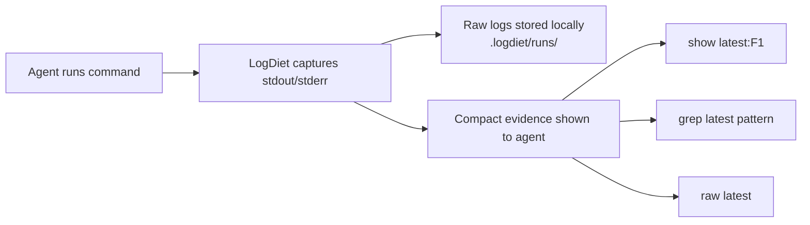

# LogDiet

<p align="center">
  <a href="./README.md">English</a> ·
  <a href="./README.ko.md">한국어</a>
</p>

<p align="center">
  <strong>Put your coding agent on a token diet.</strong>
</p>

<p align="center">
  Keep the logs. Cut the noise.
</p>

<p align="center">
  LogDiet keeps full command logs locally and feeds AI coding agents compact, expandable evidence instead of noisy terminal walls.
</p>

<p align="center">
  <a href="https://github.com/yoon-sang-won/LogDiet/actions/workflows/test.yml"></a>
  <a href="./LICENSE"></a>
  
  
  
</p>

No network. No telemetry. No model/API calls.

## Stop feeding log walls to your coding agent

AI coding agents are good at fixing code, but they often waste context on terminal output:

- long test logs;
- repeated stack traces;
- noisy build output;
- huge diffs;
- grep results;
- warnings that hide the actual failure.

Most of that output still matters. The agent just does not need all of it at once.

LogDiet stores the full output locally and gives the agent a smaller, structured view:

- what command ran;
- whether it passed or failed;
- the most relevant failure evidence;
- handles to expand exact raw lines only when needed.

## Before / After

### Before: the agent sees the whole log wall

```text
pytest -q
... thousands of lines of traceback, warnings, retries, and progress output ...
... repeated stack frames ...
... unrelated warnings ...
... the actual failure is buried somewhere above ...
```

### After: the agent sees compact evidence

```text
logdiet run 20260627T120000Z-12345-a1b2 exit=1 raw=.logdiet/runs/20260627T120000Z-12345-a1b2
cmd: pytest -q
summary: 2 failed, 31 passed
F1 tests/test_api.py:42 AssertionError: expected 200, got 500
F2 tests/test_auth.py:17 ValueError: missing token
show: logdiet show latest:F1 --around 40
raw:  logdiet raw latest
grep: logdiet grep latest "pattern"
stats: raw=18420B compact=610B approx_saved=96.7%
```

Full raw logs are still stored locally under `.logdiet/runs/`.

This example is synthetic. `approx_saved` is a byte-based reduction estimate, not a provider billing measurement.

## How LogDiet works



The loop is simple: keep raw logs on disk, show compact evidence in the terminal, and expand exact raw output only when needed.

## Try It In 60 Seconds

### macOS / Linux

```sh
go install github.com/yoon-sang-won/LogDiet/cmd/logdiet@latest
logdiet install
eval "$(logdiet env)"
logdiet doctor
logdiet wrap -- go test ./...
```

### PowerShell

```powershell
go install github.com/yoon-sang-won/LogDiet/cmd/logdiet@latest
logdiet install
Invoke-Expression (logdiet env --shell powershell)
logdiet doctor
logdiet wrap -- go test ./...
```

`@latest` works best after a release tag exists.

## For AI agents

When LogDiet is installed and `.logdiet/bin` is first in `PATH`:

- run normal commands such as `go test ./...`, `pytest`, `npm test`, `git diff`, or `rg`;
- read the compact evidence LogDiet prints;
- use `logdiet show latest:F1 --around 40` when a handle needs expansion;
- use `logdiet grep latest "pattern"` to search exact raw output;
- use `logdiet raw latest` only when compact evidence is insufficient;
- do not ask the user to paste full logs unless `show`, `grep`, and `raw` are insufficient.

A good agent response should cite the compact evidence first, then expand raw output only when needed.

## Works with

| Agent / workflow | Setup |
|---|---|
| Codex | `logdiet setup codex` |
| Claude Code | `logdiet setup claude` |
| Cursor | `logdiet setup cursor` |
| Antigravity | `logdiet setup antigravity` |
| Gemini | `logdiet setup gemini` |
| Generic terminal agents | `logdiet install` |

## Core commands

| Command | Use it when |
|---|---|
| `logdiet install` | Set up local state and PATH shims |
| `logdiet env` | Print shell activation commands |
| `logdiet doctor` | Check whether the current session uses LogDiet |
| `logdiet wrap -- <cmd>` | Capture one command manually |
| `logdiet show latest:F1 --around 40` | Expand one evidence handle |
| `logdiet grep latest "pattern"` | Search exact raw output |
| `logdiet raw latest` | Print full raw output |
| `logdiet setup codex` | Install Codex-facing rules |

## Agent quickstarts

### Codex

```sh
go install github.com/yoon-sang-won/LogDiet/cmd/logdiet@latest
logdiet setup codex
eval "$(logdiet env)"
logdiet doctor
codex
```

Creates or updates `AGENTS.md`.

### Claude Code

```sh
go install github.com/yoon-sang-won/LogDiet/cmd/logdiet@latest
logdiet setup claude
eval "$(logdiet env)"
logdiet doctor
claude
```

Creates or updates `CLAUDE.md`.

### Cursor

```sh
go install github.com/yoon-sang-won/LogDiet/cmd/logdiet@latest
logdiet setup cursor
eval "$(logdiet env)"
logdiet doctor
```

Creates or updates `.cursor/rules/logdiet.mdc`.

### Antigravity

```sh
go install github.com/yoon-sang-won/LogDiet/cmd/logdiet@latest
logdiet setup antigravity
eval "$(logdiet env)"
logdiet doctor
```

Creates or updates `.agents/rules/logdiet.md`.

### Gemini

```sh
go install github.com/yoon-sang-won/LogDiet/cmd/logdiet@latest
logdiet setup gemini
eval "$(logdiet env)"
logdiet doctor
```

Creates or updates `GEMINI.md`.

### Generic terminal agents

```sh
go install github.com/yoon-sang-won/LogDiet/cmd/logdiet@latest
logdiet install
eval "$(logdiet env)"
logdiet doctor
```

Use this when your agent reads terminal output but does not have a dedicated rules file.

## Raw expansion

```sh
logdiet show latest:F1 --around 40
logdiet raw latest --combined --tail 80
logdiet grep latest "AssertionError" --around 3
```

Raw expansion is exact. Use it when compact evidence is not enough.

## PATH shims

`logdiet install` creates local command shims in `.logdiet/bin`. Put that directory first in `PATH` for agent sessions where commands should be captured automatically.

Controls:

- `LOGDIET_BYPASS=1` runs the real command directly.
- `LOGDIET_MODE=auto` compacts known useful commands.
- `LOGDIET_MODE=force` compacts every shimmed command.
- `LOGDIET_MODE=off` bypasses compaction.

No shell profiles are modified in v0.1.

## Benchmarks

```sh
logdiet bench-fixtures
```

Sample output from synthetic local fixtures:

```text
fixture                  raw_bytes compact_bytes  approx_raw_tokens approx_compact_tokens  reduction handles
go_test_failure.txt            670           314                168                    79      53.1%       1
pytest_failure.txt             934           532                234                   133      43.0%       3
git_diff.txt                   924           630                231                   158      31.8%       2
```

Approximate token estimates use `ceil(bytes / 4)` and are not provider billing measurements.

## Privacy and local-first design

LogDiet is local-first by design:

- no network calls;
- no telemetry;
- no model/API calls;
- full raw logs stay on your machine;
- generated run logs live under `.logdiet/runs/`.

Raw logs may contain secrets, tokens, private paths, or proprietary output. Do not commit `.logdiet/runs/`, and review logs before sharing them.

## What LogDiet is not

LogDiet is not:

- a model proxy;
- a prompt compressor;
- a cloud service;
- a telemetry collector;
- a replacement for provider prompt caching;
- a tool that discards logs;
- a benchmark claiming exact provider-token savings.

It is a local command-output capture and evidence layer.

## FAQ

### Does LogDiet send my logs anywhere?

No. LogDiet does not make network calls, does not send telemetry, and does not call models or APIs.

### Are raw logs deleted?

No. Full raw command output is stored locally under `.logdiet/runs/`.

### Can raw logs contain secrets?

Yes. Raw logs can contain secrets, tokens, paths, and private data. Do not commit `.logdiet/runs/` and review logs before sharing them.

### Does LogDiet reduce my provider bill?

LogDiet reduces the amount of command output you feed into an AI coding-agent conversation. It does not measure or guarantee provider billing savings.

### Do I need PATH shims?

No. You can use `logdiet wrap -- <command>` manually. PATH shims are for agent sessions where commands should be captured automatically.

## Verification

To verify a release from a fresh clone:

```sh
git clone https://github.com/yoon-sang-won/LogDiet
cd LogDiet
./scripts/verify-release.sh
```

For manual verification, see [docs/verification.md](docs/verification.md).

## Development / release resources

```sh
go install ./cmd/logdiet
gofmt -w .
go test ./...
```

More resources:

- [README.ko.md](README.ko.md)
- [CHANGELOG.md](CHANGELOG.md)
- [docs/demo.md](docs/demo.md)
- [docs/release-notes-v0.1.0.md](docs/release-notes-v0.1.0.md)
- [docs/verification.md](docs/verification.md)
- [docs/release-checklist.md](docs/release-checklist.md)

## License

LogDiet is licensed under Apache-2.0.
